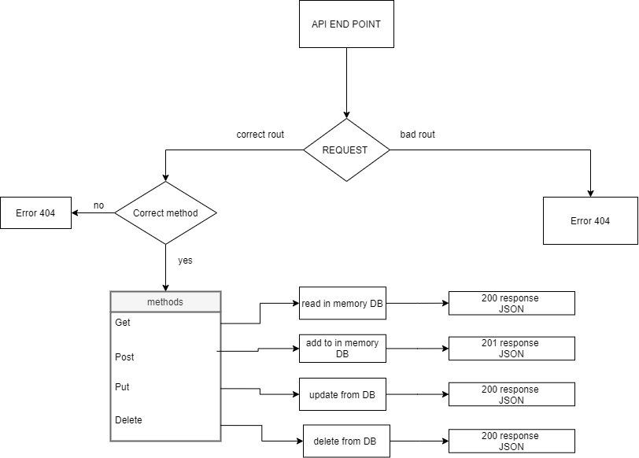

# basic-api-server


**V1.0**

## About <a name = "about"></a>

Basic 2 APIs server which supported 
`GET`
`POST` 
`DELETE`
`PUT`

By Rout At `/student` and `/animal`

## Deployment 
This project use Heroku to deployment

API Live Url: **https://mousa-basic-api-server.herokuapp.com/**

## Pull Request 

This is the Main Pull Request for this project :

**https://github.com/MousaSbbah/basic-api-server/pull/1**

## Setup
   .env requirements
     `PORT` - 3030
## Running the app
```
npm start
```
Endpoint: 
* `/student`
* `/animal`

## Tests
Github actions link :**https://github.com/MousaSbbah/basic-api-server/actions**

**Unit Tests:**
```
npm run test
```

## 
    
## UML



